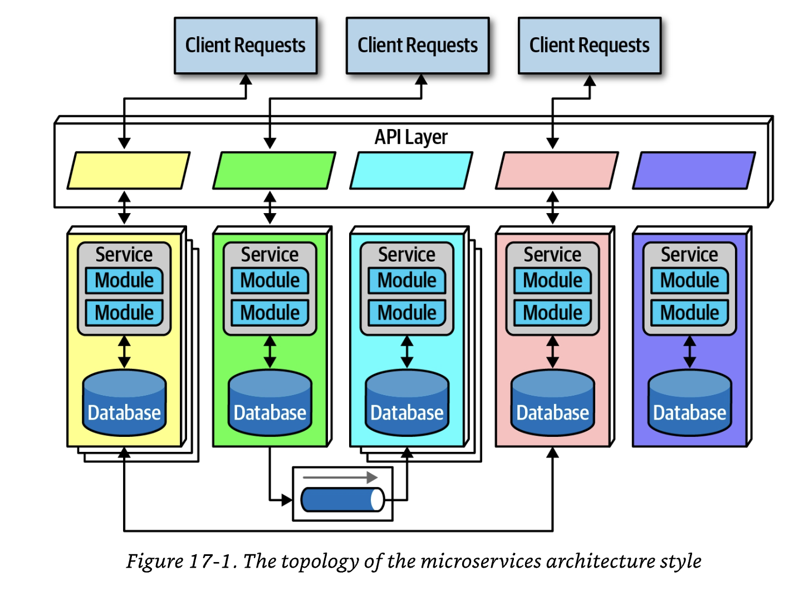

##### Microservices

- One of the most popular architecture styles 
- It has gained significant momentum in the last 7-8 years

###### History

- Most architectural styles happen because many architects end up making common decisions as their software ecosystems shifts and changes
- The common best ways of dealing with and profiting from shifts that are successful become the architectural styles which others emulate
- Microservices is different in this regard
    - Named and popularized by a famous blog entry by Martin Fowler and James Lewis
    - Blog post [here](https://martinfowler.com/articles/microservices.html)
- The blog post helped to define the architecture and it's underlying philosophy

- Microservices is heavily inspired by ideas in domain-driven design (DDD)
- The main concept that they take from DD is the concept of *bouded context*
    - Bounded context represents a decoupling style
    - When software engineers define domains, the domains include many entities and behaviors
    - In monolithic systems software engineers would share many of these concepts, building reusable classes and linked datastores
    - Within a bounded context, the internal parts of the software system are coupled together to do work, but they are never coupled to anything outside of their the counded context
    - This allows each context to define only what it needs rather than accommodating other constituents

- While reuse is beneficial, but per the First Law of Architecture the negative tradeoff of reuse is coupling
- When a software engineer designs a ssytem that favors reuse, they are also favoring coupling to achieve reuse, either through inheritance or composition

- If the software engineer's goal requires high degrees of decoupling, then they would favor duplication over reuse
- Microservices provide high decoupling, physically modeling the logical notion of bounded context

###### Topology

- The service size in mircroservices is much smaller than other distributed architectures
- Software engineers expect each service to include all necessary parts to operate independently, including databases and other dependent components

###### Distributed

- Microservices are a *distributed architecture*
- Each of the services run in their own process

- Decoupling services to such a degree allows for a simple solution to common problems in architectures which heavily features multitenant infrastructures
- By using an application server such as docker to manage and run multiple applications, this allows for operational reuse of network bandwidth, memory disk usagge and a host of other benefits
- If the supported applications continue to grow, eventually you will have some resources become constrained on the shared infrastructure
- Another problem may be the improper isolation between shared appplcations

- Separating each service into its own process solves problems brought on by sharing
- With cloud resources and container technology such as k8s software engineering teas reap the benefits of exteeme decoupling both at the domain and operational level

- Performance is often a negative side effect of distributed microservices
- Network calls take longer than method calls, and security verifications at every endpoint adds additional processing times
- This requires software engineers to think about the implications of granularity when designing systems

- It is not advised to use transactions across service boundaries, which makes the granularity of a service the key to success in this architecture

###### Bounded Context

- This is the driving philosophy of the microservice architecture
    - Each service models a domain or workflow
- Each service must include everything necessary to operate within the application, including classes, subcomponents, and database schemas
- Microservices avoid any coupling, and duplication is prefered over coupling

- Microservices take the concept of domain-partitioned architecture to the extreme
- Each service represents a domain or a subdomain, it is the physical embodiment of logical concepts in domain-driven design

###### Granularity

- Software engineers struggle to find the correct granularity for services in microservices, and often make the mistake of making their services too small
    - this requires them to buikd communication links between services to do useful work

- Software engineers take the term *microservice* as a commandment, not a description, and create services which are too fine grained

- The purpose of service coundaries in microservices is to capture a domain or workflow
- In some contexts those boundaries might be large for parts of the system

- Some guidelines
    - __Purpose__ - The most obvious boundary relies on the domain. The service should be functionally cohesive, contributing one significant behaviour on behalf of the overall application
    - __Transactions__ - Bounded contexts are business workflow, most often the entities which need to cooperate in a transaction show architects a good service boundary
    - __Choreography__ - If software engineers build a set of services which offer excellent domain isolation yet require extensive communication to function, software engineers should consider bundling those services back into a larger service to avoid communication overhead

- Iteration is the only way to ensure good service design
- Software engineers rarely discover the perfect granularity, data dependencies and communication styles on the first pass

###### Data Isolation

- Another requirement of microservices is data isolation
- Microservices try to avoid all kinds of coupling, including shared schemas and databases used as integration points

- Data isolation is a factor that software engineers must consider when looking at service granularity
- Software engineers must be wary of the entity trap and not model their services to resemble single entities in a database

- You no longer can use a relational database to create a single source of truth when distributing data across a distributed system
- Software engineers must must figure out how to distributed data via DB replication and caching distributed information

- While data isolation created headaches, it also provides many opportunities
- Since software engineering teams aren't forced to unify around a single DBm each service can choose the most appropriate tools to use for their data needs

###### API Layer

- Most microservices include an API layer sitting between the consumers of the system
- This layer is a good location to perform useful tasks, via indirection as a proxy or a tie into operational facilities

- While API Layers may be used for a variety of things, it shouldn't be used as a mediator or orchestration tool 
- All logic in the microservice architecture should occur into a bounded context
    - Placing orchestration and logic into a mediator violates the rules of microservices
- Microservices are firmly domain partitioned

###### Operational Reuse

- Given that microservices prefer duplication to coupling, how do software engineers handle parts of the system that really can benefit from coupling, such as operational concerns like monitoring, logging, circuit breakers, etc.
- In microservices these concerns are split

- Once a team has built several microservices, they will realize that each has common elements that benefit from similarity
- Each team needs to implement loggin and monitoring for their services
- Each team needs to enure they upgrade theor tools and services accordingly

- The *sidecar* pattern offers solutions to some of these problems

- Common operatin concerns appear within each service as a separate component
- The sidecar componenet handles all of the operational concerns which teams benefit from coupling together
- When it comes times for upgrades, the sidecare can be updated and each service associated with the sidecar receives the upgrade

- Once teams know that eacch service includes a common sidecar, they can start building a service mesh, which allows unified control across the architecture for concerns like loggin and monitoring
- The sidecar components connecft to form a consisten operational interface across all microservices

- The sidecars wire into a service plane, which forms the consistent interface to each of the services
- The service mesh itself forma a console that allows software engineers a holistic access point to services

- Each of the services form a node in the overall mesh
- The ervice mesh forms a console allowing teams to globally controll operational coupling, monitoring, logging, and other cross-cutting operational concerns

- Service discovery is built into the mesh to provide elasticity into mircoservice atchitectures
- Rather than invoking a single service, the request goes through a service discovery tool, which can monitor the number and frequency of requests, as well as spin up new instances of services to handle scale and elasticity concerns
- The API layer is often used to host service discovery, allowing a single place for user interfaces or other callign systems to fina and create services in a elastic and consistent way

###### Frontends

- Microservices favor decoupling which ideally could encompass the user interfaces as well as the backend concerns
- Practicalities of the partitioning required by web applicaitons and external constraints make this goal difficult
- Two styles of user interfaces commonly appear for microservice architectures

- The monolithic frontend features a single user interface which calls through the API alyer to satisfy user requests
- This can be a rich desktop, mobile or web application

- The microfrontend utilizes components at the user interface level to create a synchronous level of granularity and isolation in the user interface as the backend services
- Each service emits the user interface for that service, which the frontend coordinates with the other emitted user interface components
- Teams can isolate service boundaries from the user interface to the backend services, unifying the entire domain within a single team
- The midrofrontend pattern can be implemented in a variety of ways, either using a component-based web framework

###### Communication

- Finding the correct communication style helps teams keep services dcoupled yet still coordinated in useful ways
- Sotware engineering teams must decide on *synchronous* vs *asynchronious* communications
- Protocol aware heterogeneous interoperability
- Protocal aware
    - microservices don't include a centralized integration hub to avoid operational coupling, each service must know how to call other services
    - Software engineers must standardize on how particular services call each othert
        - REST
        - Message queues
- Heterogeneous
    - Each service might be written in a different technology stack
    - The service must fully support a polyglot environment, where different services use different platforms
- Interoperability
    - Services must be able to call one another
    - Services call one another via the network to collaborate and send/receive information

- For asunchronous communication, architects often use events and messages, thus using an event-driven architecture

###### Choreography and Orchestration

- Choreography utilizes the same communication style as a broker-driven architecture
- There is no central coordinator
- Software engineers find it natural to implement decoupled events between services
- **Domain/architecture isomorphism** is a key characteristic that softwae engineers should look for when assessing how to appropriate an architectural style is for a particular problem
- The term describes how the shape of an architecture maps to a particular architectural style
- Since in microservice architecture favors decoupling, the shape of microservices resembles a broker EDA
- Each service calls other services as needed, without a central mediator

- Since microservice architecture doesn;t include a global mediator, if a software engineering team needs to coordinate across serveral services, they can create their own localized mediator

- The service mediator sole responsibility is coordinating the call to get all of the information for a particular need
- While a service mediator creates coupling between services, it allows software engineers to focus coordination into a single service, leaving other services less affected

- *Front controller* pattern is where a nominally chreographed service becomes a more complex meiator for the system
- The downside to this is the added complexity in the service

###### Transactions and Sagas

- Microservices are extememly decoupled, but software engineers encounter the problem of how to do transactional coordination across the services
- Since decoupling in the architecture encourages the same level for the database, atomicity that was trivial in monolithic applications becomes a problem in distributed systems
- Building transactions across service boundaris violates core decoupling principle in microservice architecture
- You can't do transactions across services
- Fix the granularity of your components
- Transaction boundaries in one of the common indicators of service granularity

- **Saga** pattern

- A service acts as a mediator across multiple service calls and coordinates the transaction
- The mediator calls each part of the transaction, recordssuccess or failure, and coordinates results
- If everything goeas as planned, all the values in the service and their contained databases update syunchronously
- In an error condition, the mediator must ensure the no part of the transaction succeeds if one part fails
- The mediator must send requests to all parts of the transaction that were successful and tell them to undo the preious requests
- This is called a *compensating transaction framework*
- Developers implement this pattern by usually having each request from the mediator enter apending state until the mediator indicates overall success
- This pattern becomes complex if asynchronous requests must be juggled, especially if new requests appear that are contingent on pending transactional state
- This also creates a lot of coordination traffic at the network level

###### Atchitecture Characterisits Rating

___

##### Choosing an Architecture

- Choosing an architect style represents the culmination of analysis and thought about trade-offs for architecture characteristics, domain considerations, strategic goals, and a host of other things

###### Shifting "Fasion" in Atchitecture

- Factors
    - Observations from the past
        - New architectural styles generally arise from observations and pain points from the past
        - Software engineers have experience with systems in the past that influence their thoughts about future systems
        - Often new architectures reflect specific deficiencies from the past
    - Changes in the ecosystem
        - Software development has constant change
    - New capabilities
        - Software development shifts to a new paradigm
        - Constant change in the ecosystem delivers new collections of tools and capabilities
    - Acceleration
        - THe rate of change continues to rise
        - New tools create new software engineering practices leading to new design and capabilities
    - Domain changes
        - The domain for developing software constantly shifts and changes
    - Technology changes
    - External factors
        - licensing costs

###### Decision Criteria

- The domain
    - You must have a good general understanding of the major aspects of your domain
- Architecture characteristics that impace structure
    - You must discover the architectural chracteristics needed to support the domain
- Data architecture
    - Software engineers must coordinate with DBAs on databse, schema and other data-related concerns
    - Software engineers must understand the impact that data design might have on their software system design
- Organizational factors
    - External factors
- Knowledge of process, teams, and operational concerns
    - Business factors and team factors
- Domain/architecture isomorphism
    - What's the problem domain

- Severla determinations must be made by software engineers
    - Monolith vs distributed
    - Where should data live

- What communication styles between services (synchronous or asynchronous)
