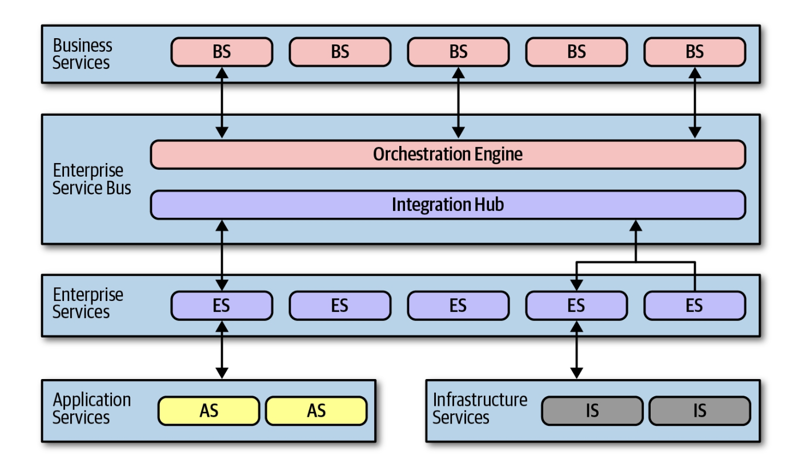
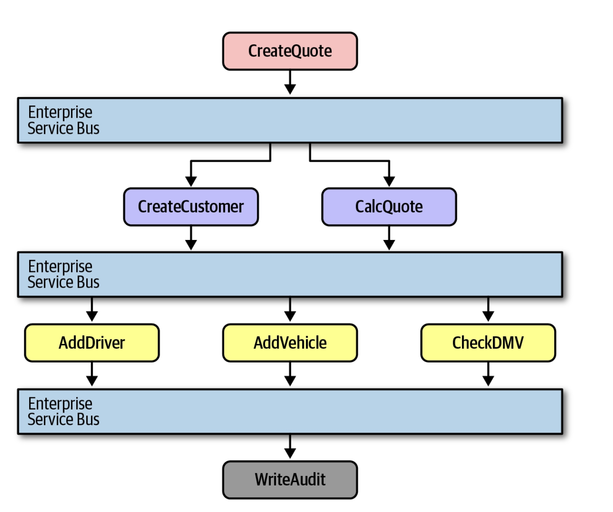
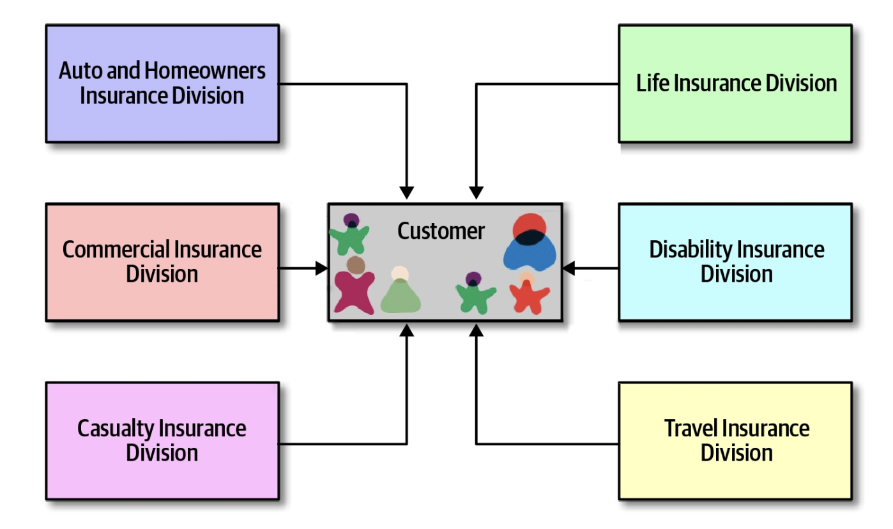
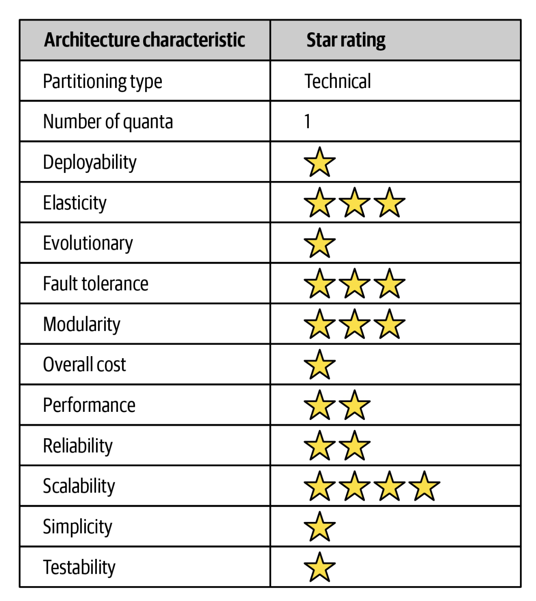

#### Orchestration Driven Service Oriented Architecture

- Part of the 90s
- An organization idea which hindered softwae development process

##### History

- A popular approach during the many company mergers of the 1990s
- Growth at break neck pace and required more sophisticated IT to accomodate growth
- Computing resources were still scare and expensive
- Distributed computing was in it's infancy, and companies found it necessary for it's variable scalability and other beneficial characteristics

- Software Engineers and Software Architects moved towards distributed software architectures
- The OS was the workhourse of the distributed system, however OSs were expensive and licensed per bare bones machine
- DBs had outdata licensing schemes and DB vendors and application vendors, who offered DB connection pooling, to duke it out with each other
- Software engineers and software architects were forced to reuse elements and systems as much as possible
- `Reuse` in all forms was the dominant philosophy of that era
    * There were side effects 

##### Topology

- Layers may very from system to system
- All systems followed the idea of establishing a taxonomy of services, with each layer having a specific responsibility

##### Taxonomy

- The software engineer's and software architect's philosophy in this architecture centered around enterprise level reuse
- Each layer of the software taxonomy suported the goal of resuse
- Business services sit at the top of the architecture and provide the entry point into the software system
    * Each service represented a domain behavior 
    * Service definitions contained no code, only input, output and schema information
    * Defined by business users
- The Enterprise Services contained fine-grained shared implementations of the software system
    * Software engineers were tasked with building atomic behavior around particular business domains
    * Separation of responsibility flows from the reuse goal in this architecture
    * Developers should build fine-grained enterprise services at just the correct level of granularity, so as not to re-write the enterprise service at a later point in time
    * The idea was to build up a collection of reusable assets in the form of reusable enterpirse services
    * The dynamic nature of business defies reusability
- Application Services
    * Not all of the services required the same level of granularity or reuse as the enterprise services
    * Application services were one-off, single implementation services
    * Typically these services were owned by a specialized software engineering team
- Infrastrucutre Service
    * These services supplied the operational concerns, like monitoring, logging, authentication, and authorization
    * These were concrete implementations owned by a infrastrucutre team
- Orchestration Engine
    * This is the hear of the distributed software system
    * Stitches together the business service implementations via orchestration, transactional coordination and message transformation
    * Usually the software system is tied to a single RDB or a few, therefore transactional behaviour is handled declaratively in the orcestration engine rather than in the DB
    * The orchestration engine defined the relationship between the business and enterprise services, how they mapped to each other and their transactional boundaries
    * The Orchestration Engine also acted as an integration hub, allowing software engineers to integrate custom code with packaged and legacy software systems
    * Since orchestration engine forms the heart of the architecture, via Conway's law the Integration and Infrastrucutre team are responsible for this engine and become the political force and bureaucratic bottleneck within the organization

- The approach looked appealing, in practice it was a disaster
    * Offloading transactions to a orchestration tool sounded good, however finding the correct level of granularity for transaction was very difficult
    * Building a few services wrapped in a distributed transaction becomes increasingly complex as software engineers need to figure out where the appropriate transaction boundaries lie between services

###### Message Flow

- All requests flow through the orchestration engine, this is where the logic for this resides in the software system
    * Even internal call go through the orchestration engine

##### Reuse and Coupling

- The major goal of this service srchitecutre was reuse at the service level
    * The gradual ability to build business behaviour that can be incrementatlly reused over time
    * Software architects and software engineers were instrucuted to find opportunities for reuse as aggressively as possible
    

- You need to extract the common cannonical parts of a software system into a reusable service, i.e. a customer service
    * All customer behaviour is isolated into a customer service, achieving the reuse goal

- It was slowly realized the negative tradeoffs of this software architecture
    1. When you build a system around reuse you incur a huge amount of coupling between components
        * Changes in the customer service ripples out to all of the other services, making any type of change risky
        * Incremental change is impossible to do
        * There was a need for coordinated deployments, holistic testing, and other drags on efficiency
    2. ALl details are contained about the entity encapsulated in the service
        * The customer service would have all the information within it, i.e. DL number which may or may not be needed by other parts of the softwae system
    3. It's impractical to biuld an architecture so focused on technical partitioning
        * Makes sense from a separation and reuse philosophy
        * To run and service it was a nightmare
        * Domain concpets get spread so thinly throughout the architecture that they ceased to be concepts anymore
        * Writing stories and tasks for software engineers became difficult, since doznes of services in different tiers and touchpoints had to be updated, plus any changes in the DB
        * If services are not defined at the correct transactional granularity, software engineers would either have to change their design or were forced to build a new and near identical service to change transactional behaviour
        * Reuse went out the door

##### Architecture Characteristics Rating
- The criteria we use now to evaluate architecture were not priorities in the 1990s when this architectural style prevailed

- Service oriented architecutre was the most technically partitioned general purpose atchitecture attempted
- Backlash against it lead to the advent of microservices
- It is consudered a distributed system architecture however with pitfalls
    1. It uses a single DB or jsut a few DBs, which created coupling points within the architecture across many different concerns
    2. The orchestration engine is a giant coupling point, no part of the architecture can have different achitecture characteristics than the mediator that orchestrated all behaviour

- The architecture manages to find the disadvantages of both monolithic and distributed architectures
- Deployability and testability score low with this architecture
    * there were poorly supported and they were not important
- The architecture did support goalls such as elasticity and scalability
    * Software vendors to the resuce, vendor poured enormous effort into making systems scalable by building session replication across application servers and other techniques
- Performance was never a highlight of this architecture style and was extremely poor becuase each request was split accross so much of the architecture
- Simplicity and cost had the inverse relationship with this architecture style, it cost more money and effort to service these types of systems

